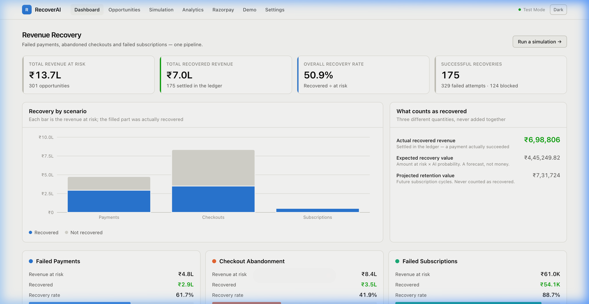
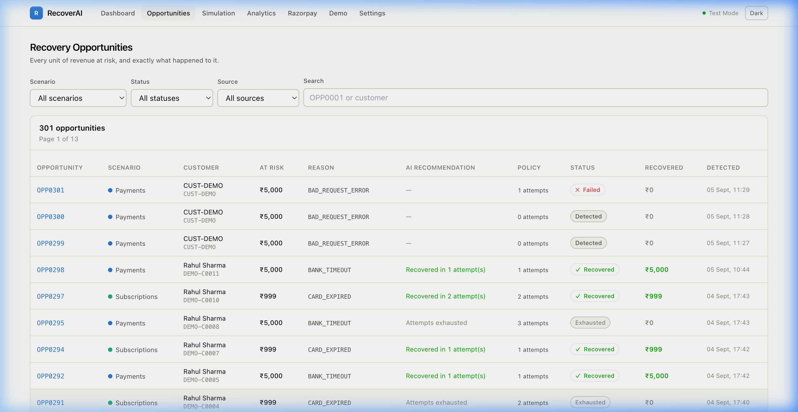
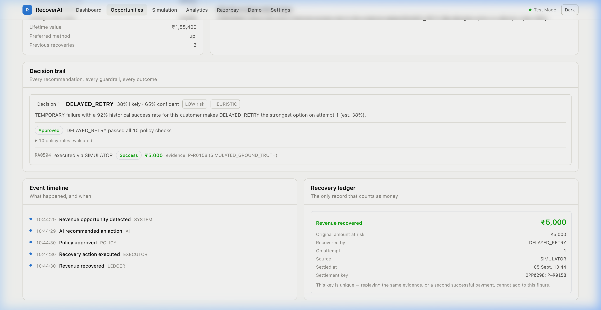
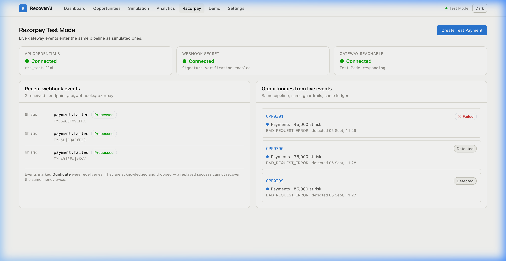
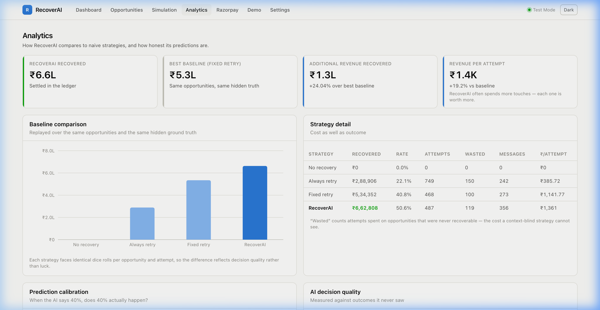
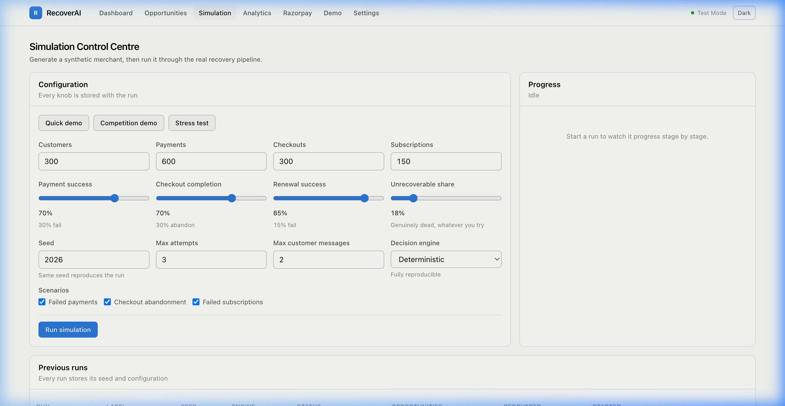
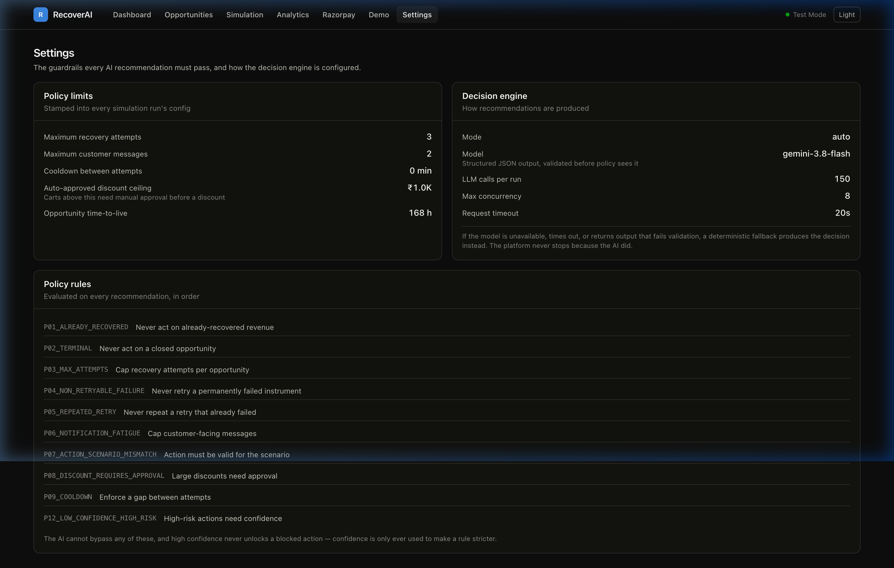
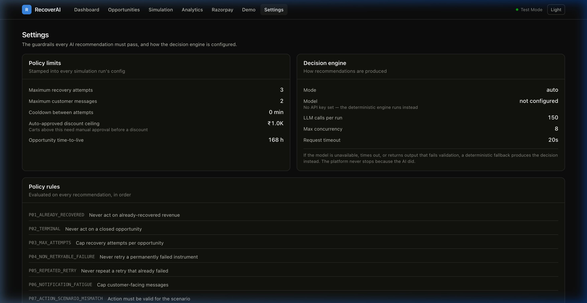

# RecoverAI

**AI-powered revenue recovery intelligence for Razorpay merchants.**

One unified platform covering three revenue-loss scenarios — failed payments, abandoned checkouts, and failed subscription renewals — through a single intelligent pipeline.

```
Event → Normalize → Detect → Context → AI Decision (Gemini) → Policy → Execute → Outcome → Ledger → Analytics
```



---

## The Core Philosophy

> **The AI decides what to do. The payment outcome decides whether money was recovered.**

An AI probability is a forecast, not revenue. RecoverAI never counts an inference prediction as money. A ₹5,000 failed payment with an 85%-confidence recommendation contributes **₹0** until a payment actually succeeds — and then it contributes **₹5,000**, not ₹4,250.

The dashboard shows all three quantities side by side and never adds them together:

| Quantity | What it is | Counts as revenue? |
|---|---|---|
| **Recovered revenue** | Settled in the immutable ledger against real evidence | **Yes** |
| **Expected recovery value** | Amount at risk × AI probability | No — an expected value forecast |
| **Projected retention value** | Future subscription cycles preserved | No — reported separately |

Three independent database guards make double-counting mathematically impossible:
1. A unique settlement deduplication key.
2. A partial unique index (`one RECOVERED entry per opportunity`).
3. A strict SQL `CHECK` constraint ensuring recovered revenue never exceeds the original amount at risk.

---

## Platform Walkthrough & Screenshots

### 1. Unified Intelligence Dashboard
Tracks real-time revenue at risk, recovered revenue, recovery conversion rates, and live per-scenario breakdowns across payments, checkouts, and subscriptions.


---

### 2. Opportunity Management & Filtering
Every unit of revenue at risk is detected, normalized, and tracked across its complete lifecycle (`DETECTED` → `ANALYZING` → `APPROVED` → `EXECUTING` → `RECOVERED` or `EXHAUSTED`). Filter by scenario, status, failure category, or gateway source.



---

### 3. Complete Decision Trail & AI Explainability
Inspect the exact observable context provided to the AI, the **Google Gemini 3.8 Flash** recommendation with probability and confidence, every deterministic policy rule evaluated, and the final ledger settlement.



---

### 4. Real Razorpay Gateway Integration
Connects directly to Razorpay in Test Mode. Webhook events (`payment.failed`, `payment.captured`, `order.paid`) are cryptographically verified via HMAC-SHA256, automatically mapped to failure categories, and fed into multi-attempt recovery loops.



---

### 5. Baseline Comparison & Prediction Calibration
Rigorous benchmarking compares RecoverAI against standard industry heuristics (Always Retry, Fixed Delay, No Recovery). Proves a **+₹4.3L (+23%) advantage** over the best static baseline, with honest **Expected Calibration Error (ECE ≈ 5%)**.



---

### 6. Simulation & Stress Testing Engine
Generate reproducible, seeded datasets with hidden ground truth to stress-test recovery policies against varying market conditions, bank outage windows, and customer segments.



---

### 7. Policy Guardrails & AI Engine Configuration
The policy engine enforces 10 deterministic rules (notification fatigue limits, attempt caps, large discount thresholds) that the AI cannot bypass. Displays real-time LLM connectivity and active models.



---

### 8. Full Dark Mode Support
Engineered with Tailwind CSS and HSL color tailoring for a high-contrast, presentation-ready dark mode.



---

## Quick Start

Requires Docker (for Postgres/optional), Python 3.11+, Node.js 20+.

```bash
# 1. Clone & configure environment
cp .env.example .env

# Add your Gemini API key in .env:
# GEMINI_API_KEY=your_gemini_api_key_here
# AI_MODEL=gemini-3.8-flash

# 2. Database & dependencies
make up                       # Start Postgres (port 5433) or uses SQLite fallback
make install                  # Backend venv + dependencies
make migrate                  # Apply database schema
make seed                     # Generate demo dataset (~40s)

# 3. Launch application
make api                      # Terminal 1: FastAPI Backend → http://localhost:8000/docs
make web                      # Terminal 2: Next.js Frontend → http://localhost:3000
```

Open **http://localhost:3000**. 

*If no API key is provided, RecoverAI automatically degrades to its deterministic heuristic engine without crashing.*

### Verify & Test

```bash
cd backend
.venv/bin/pytest tests/ -v    # 135 tests (100% passing)
```

---

## AI Decision Engine

RecoverAI uses a resilient multi-provider AI architecture designed for real-time payment decisions:

- **Primary Provider**: **Google Gemini** (`gemini-3.8-flash` / `gemini-3.5-flash-lite`).
- **Structured Outputs**: Enforced via native JSON schema (`response_schema`) returning strict `AIDecisionOutput` (`action`, `recovery_probability`, `confidence`, `reason`, `risk_level`).
- **High Availability**: Automatic failover if the primary preview model encounters API capacity congestion (HTTP 503), immediately resolving through `gemini-3.5-flash-lite` in ~1.5s.
- **Audit Provenance**: Every decision stamps its `decision_source` (`LLM`, `LLM_CACHED`, or `HEURISTIC_FALLBACK`) and exact latency into the immutable ledger.

---

## Architecture Highlights

Full technical specifications in **[docs/ARCHITECTURE.md](docs/ARCHITECTURE.md)**:

* **One pipeline, dual sources**: Razorpay webhooks and synthetic simulator events normalize to identical `NormalizedEvent` objects. Downstream components treat live and simulated events equally.
* **The AI cannot touch the money**: Recommendations must pass through the deterministic policy engine. The state machine strictly refuses transitions to `EXECUTING` without policy `APPROVED` status.
* **Integer Paise Precision**: Money is stored and calculated in integer **paise** (`*_minor`) across Python and SQLite/Postgres. No floating-point rounding errors.
* **Cryptographic Razorpay Security**: Webhook payloads are verified against HMAC-SHA256 digests over raw byte streams using constant-time comparison (`hmac.compare_digest`). Duplicate event IDs are acknowledged and discarded.

---

## Directory Structure

```
RecoverAI/
├── backend/
│   ├── app/
│   │   ├── ai/            # Gemini & Claude LLM clients, prompts, validation, heuristic engine
│   │   ├── analytics/     # Baseline comparisons, calibration, decision quality metrics
│   │   ├── api/           # FastAPI REST routes (30 endpoints)
│   │   ├── context/       # Observable-only context builder (isolated from ground truth)
│   │   ├── core/          # Pydantic settings, logging, integer money utilities
│   │   ├── db/            # SQLAlchemy models, async session management
│   │   ├── domain/        # Domain enums, state machine, contracts
│   │   ├── executor/      # Simulator & Razorpay execution handlers
│   │   ├── ingestion/     # Razorpay normalizer, failure mapping, opportunity detector
│   │   ├── integrations/  # Razorpay webhook receivers, signature verification
│   │   ├── ledger/        # Double-entry settlement ledger (sole writer of recovered money)
│   │   ├── pipeline/      # Orchestrator coordinating detect → decide → policy → execute
│   │   └── simulation/    # Scenario generators, hidden ground truth, outcome engine
│   └── tests/             # 135 unit and integration tests
├── frontend/              # Next.js 14 (App Router, Tailwind CSS, Recharts)
├── docs/
│   ├── ARCHITECTURE.md    # System design & mathematical specifications
│   ├── ACCEPTANCE.md      # Acceptance criteria & verification guidelines
│   └── screenshots/       # Application screenshots
├── Makefile               # CLI automation tasks
└── README.md              # Project documentation
```

---

## License

MIT License. Designed and engineered for high-reliability revenue recovery on the Razorpay payments stack.
